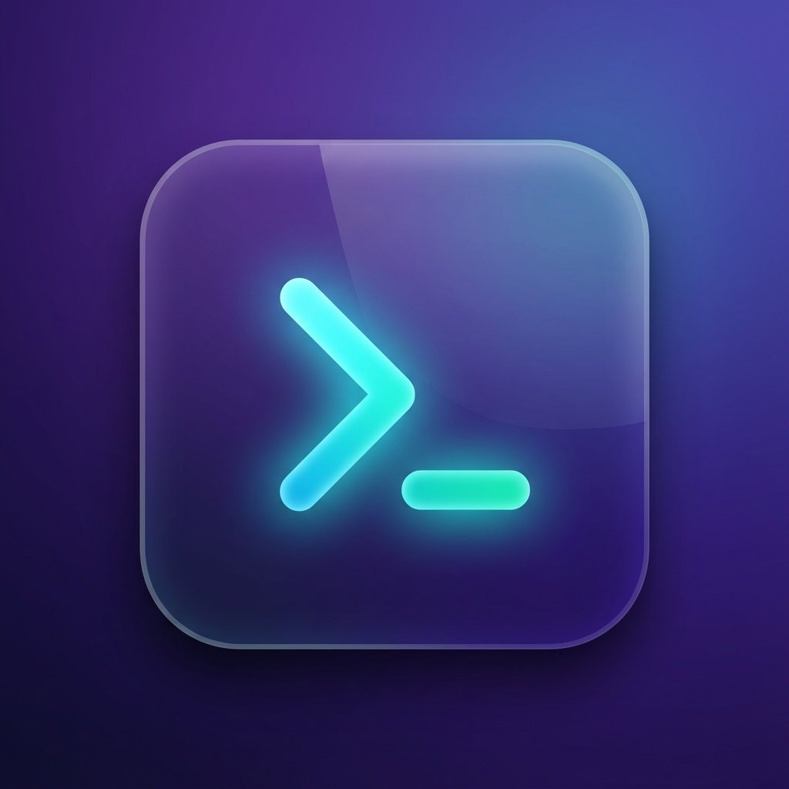

# Termfa

<div align="center">



**A fast, lightweight terminal for DevOps — connect to your servers instantly**

[](https://github.com/Foshati/Termfa/releases)
[](LICENSE)
[](https://tauri.app)
[](https://reactjs.org)

[Download](#-download) • [Features](#-features) • [Installation](#-installation) • [Usage](#-usage)

</div>

---

## 📥 Download

| Platform | Download |
|----------|----------|
| **macOS (Apple Silicon)** | [.dmg](https://github.com/Foshati/Termfa/releases/latest) |
| **macOS (Intel)** | [.dmg](https://github.com/Foshati/Termfa/releases/latest) |
| **Windows** | [.msi / .exe](https://github.com/Foshati/Termfa/releases/latest) |
| **Linux** | [.deb / .rpm / .AppImage](https://github.com/Foshati/Termfa/releases/latest) |

---

## ✨ Features

- 🚀 **Fast & Lightweight** — Built with Tauri and Rust for maximum performance
- 📑 **Multi-Tab Support** — Open multiple terminal sessions in tabs
- 🔲 **Split Panes** — Horizontal and vertical splits like iTerm2
- 🖥️ **SSH Manager** — Save and quickly connect to your servers
- 🎨 **Beautiful UI** — Modern dark theme with customizable colors
- ⌨️ **Keyboard Shortcuts** — Boost your productivity
- 💾 **Layout Persistence** — Your tabs and splits are saved automatically

---

## ⌨️ Keyboard Shortcuts

| Shortcut | Action |
|----------|--------|
| `⌘/Ctrl + T` | New tab |
| `⌘/Ctrl + W` | Close tab |
| `⌘/Ctrl + D` | Split vertical |
| `⌘/Ctrl + Shift + D` | Split horizontal |
| `⌘/Ctrl + [` | Previous tab |
| `⌘/Ctrl + ]` | Next tab |

---

## 🛠️ Tech Stack

- **Frontend**: React 19, TypeScript, Tailwind CSS, Xterm.js
- **Backend**: Tauri 2.0, Rust
- **Build**: Vite 7, Bun

---

## 📦 Installation

### From Source

```bash
# Clone the repository
git clone https://github.com/Foshati/Termfa.git
cd Termfa

# Install dependencies
bun install

# Run in development mode
bun run tauri:dev

# Build for production
bun run tauri build
```

### Prerequisites

- [Node.js](https://nodejs.org/) (v18+)
- [Bun](https://bun.sh/)
- [Rust](https://www.rust-lang.org/)
- [Tauri prerequisites](https://tauri.app/v1/guides/getting-started/prerequisites)

---

## 🚀 Usage

### Local Terminal
Simply open the app to get a local terminal session.

### Connect to SSH
1. Click on **Hosts** in the sidebar
2. Click **+** to add a new host
3. Enter your server details (hostname, port, username)
4. Click on the host to connect

### Split Panes
- `⌘+D` for vertical split
- `⌘+Shift+D` for horizontal split
- Drag the divider to resize

---

## 🎨 Themes

Termfa comes with built-in themes:
- **Default** (GitHub Dark)
- **Dracula**
- **Solarized Dark**
- **One Dark**

Change themes in **Settings** (gear icon in sidebar).

---

## 🤝 Contributing

Contributions are welcome!

1. Fork the repository
2. Create a feature branch (`git checkout -b feature/amazing`)
3. Commit your changes (`git commit -m 'Add amazing feature'`)
4. Push to the branch (`git push origin feature/amazing`)
5. Open a Pull Request

---

## 📝 License

This project is licensed under the **MIT License**. See [LICENSE](LICENSE) for details.

---

## 👨‍💻 Author

**Foshati**

- GitHub: [@Foshati](https://github.com/Foshati)

---

<div align="center">

⭐ If you like Termfa, give it a star!

**Connect Fast. Stay Light.**

</div>
